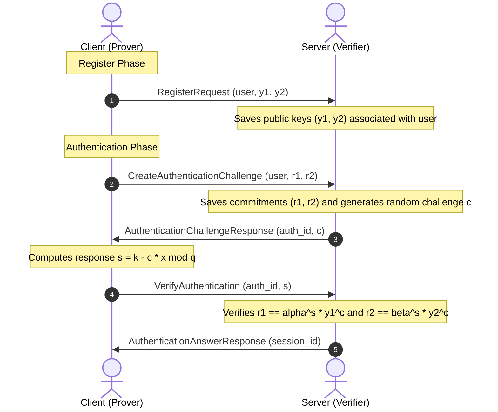

# Chaum-Pedersen ZKP Authentication (Rust & gRPC)

This project implements a decentralized, zero-knowledge authentication service in Rust using **gRPC** and the **Chaum-Pedersen protocol**. It demonstrates how a client (Prover) can securely authenticate with a server (Verifier) without ever transmitting or storing their password (or password hashes) on the server.

The core cryptographic details and mathematical proof of correctness are documented in [Chaum-Pedersen.md](Chaum-Pedersen.md).

---

## The Zero-Knowledge Authentication Flow

Traditional authentication requires sending a password to a server (which compares it with a salted hash). If the database is leaked, attackers can perform offline brute-force attacks to crack the hashes.

This project completely eliminates that risk. The password is treated as a secret exponent $x$, and authentication uses a **Zero-Knowledge Proof (ZKP)**:



### Why This Is Secure:
1. **Password Never Shared:** The password $x$ is never sent over the network or saved anywhere on the server.
2. **No Password Hashes Stored:** The server only stores the public keys $y_1 = \alpha^x \pmod p$ and $y_2 = \beta^x \pmod p$. Even if the server's database is entirely compromised, an attacker cannot recover $x$ because finding $x$ from $y_1$ or $y_2$ requires solving the **Discrete Logarithm Problem**, which is computationally hard.
3. **No Replay Attacks:** Every authentication session generates a fresh random nonce $k$ and a fresh verifier challenge $c$. A captured response $s$ from a previous session is completely useless for future authentications.

---

## gRPC API Design

The communication uses gRPC for low-latency, strongly typed, and efficient communication. The interface is defined in [proto/zkp_auth.proto](proto/zkp_auth.proto):

```protobuf
service Auth {
    // Registers the user's public keys (y1, y2) linked to their username
    rpc Register(RegisterRequest) returns (RegisterResponse);
    
    // Initiates authentication by sending commitments (r1, r2) to receive a challenge (c)
    rpc CreateAuthenticationChallenge(AuthenticationChallengeRequest) returns (AuthenticationChallengeResponse);
    
    // Submits the response (s) to verify the challenge and output a session ID
    rpc VerifyAuthentication(AuthenticationAnswerRequest) returns (AuthenticationAnswerResponse);
}
```

---

## Project Structure

- `proto/`
  - [zkp_auth.proto](proto/zkp_auth.proto): Protobuf definition of the gRPC service and messages.
- `src/`
  - [lib.rs](src/lib.rs): Core cryptographic functions (modular exponentiation, proof solving, verification, and random number generation).
- [build.rs](build.rs): Cargo build script configured to automatically compile the Protobuf file into Rust using `tonic-prost-build`.
- [Chaum-Pedersen.md](Chaum-Pedersen.md): Cryptographic description, interactive flow breakdown, mathematical definitions, and security definitions.

---

## How to Run

### Method A: Using Docker (Recommended for Server)

A Docker configuration is provided to run the gRPC server inside a container, exposing the server on port `50051` to the host machine.

1. **Build and start the gRPC Server:**
   ```bash
   docker-compose up --build
   ```
   This automatically compiles the project in a Linux container and starts the server.

2. **Run the Client (on Host Machine):**
   In a separate terminal on your host machine, run:
   ```bash
   cargo run --bin client
   ```

---

### Method B: Running Locally

Since everything is managed by Cargo and Tonic, you do not need to install `protobuf` or `protoc` manually on your system.

1. **Build the Project:**
   ```bash
   cargo build
   ```

2. **Run Tests:**
   ```bash
   cargo test
   ```

3. **Start the Server:**
   ```bash
   cargo run --bin server
   ```

4. **Start the Client:**
   In a separate terminal:
   ```bash
   cargo run --bin client
   ```
